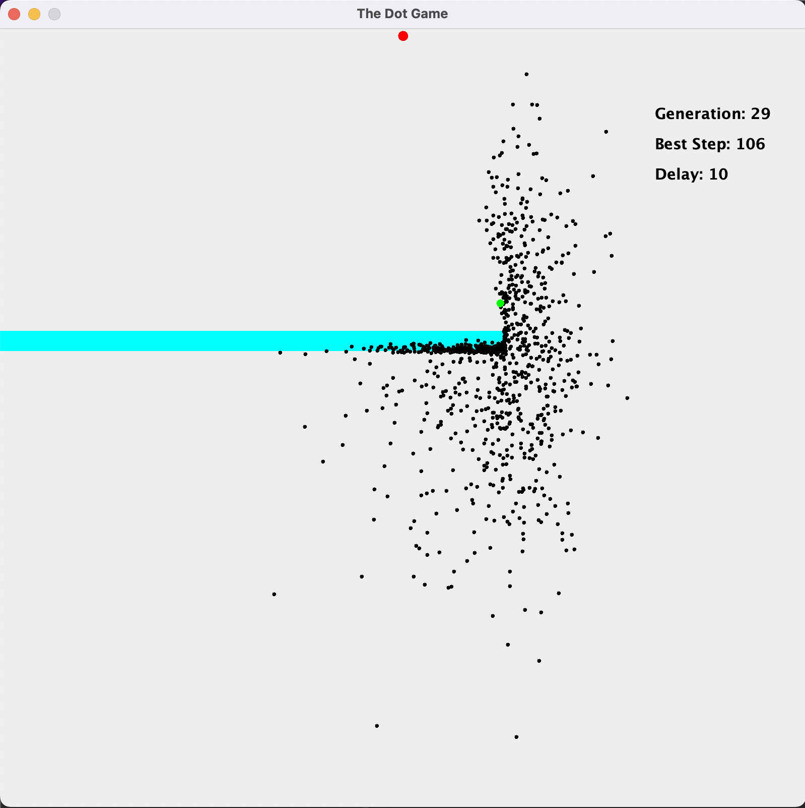
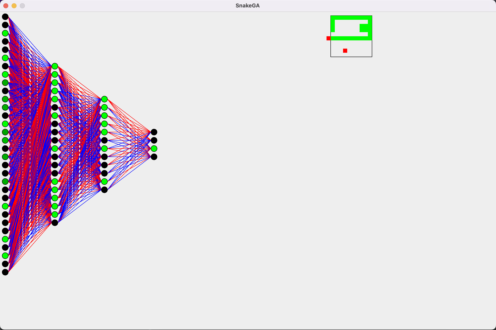
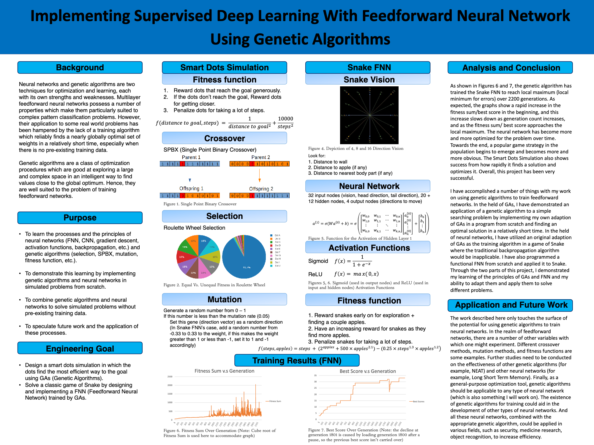

# Snake-GA
Hi! Welcome to my 2020 ISEF Finalist project on training an AI with genetic algorithms to play the Snake game

This project, titled **Implementing Supervised Deep Learning with Feedforward Neural Network Using Genetic Algorithms**, had qualified for and was submitted to Regeneron ISEF 2020, here is a link to the [abstract](https://abstracts.societyforscience.org/Home/FullAbstract?Category=Any%20Category&AllAbstracts=True&FairCountry=Any%20Country&FairState=Any%20State&ProjectId=19336), the content of which I have also included below.

### Abstract

Neural networks and genetic algorithms (GAs) are two techniques for optimization and machine learning, each with its own strengths and weaknesses. This project demonstrated the efficiency and applications of genetic algorithms and a neural network trained with genetic algorithms by implementing a combination of both to solve simulated problems without pre-existing data. A smart dots simulation program was designed and programmed in which the dots found the most efficient way to the goal using GAs. Then, a feedforward neural network (FNN) was designed for playing the game of Snake and was trained by GAs. The algorithms were implemented for each problem in Java. For each generation, the fitness of the fittest individual and the fitness sum of the population were recorded, and graphed in excel. Data was analyzed for trend of growth. The genetic algorithm trained the Snake FNN to reach local minimum for errors over 6000 generations. A popular game strategy in the population emerged and became more obvious towards the end of training. The fitness sums of generations of both the smart dots simulation and the Snake FNN reflected logistic growth. The smart dots simulation consistently found the solution within the first 15 generations and optimized it in the next 100 generations. This project demonstrated that a combination of GAs and neural networks could be used to effectively solve complex pattern classification problems without pre-existing data. This method could be applied to various fields, such as drug research, where it can be used to find the best-performing drugs from an array of possible candidates.

### TheDotGameGA

I implemented TheDotGameGA as a proof of concept of/practice for implementing genetic algorithms. The dots have randomly-initialized brains that passes on through the generations through my implementation of natural selection and mutations. Their goal is to get as close to the final red dot as possible or to get there in as little steps as possible. Their fitness is calculated through how well they each accomplish their goal and the most successful ones have the highest chance of passing down their genes, or brains.

Also included is a class that helps the user create obstacles that disable any dot that comes in contact with them from moving. This served as an additional challenge for the dots to adapt to.

After verifying that my implementation of genetic algorithms works, I moved on to making the SnakeGA.

### SnakeGA

So the story of how I decided how to do this portion of the project was quite funny. At the time, I was way more comfortable with Java than any other programming languages (and for good reasons). So when I faced the option to learn one of the main stream machine learning libraries, I thought to myself "why not make it a challenge to make my own?" The idea is that this way I'm forcing myself to learn more about how machine learning and neural networks work, and how this whole thing synergizes with genetic algorithms. Because when you need to implement your own ML library from scratch, and in a not so popular language for this purpose at that (Java), you have to know the ins and out of the whole construction. And looking back now, it was a really funny choice that led to a lot of amazing things. I often tell friends now that I made my own ML library out of laziness: I was so uncomfortable with learning and using another language/library that I'd rather make my own and use that instead! As a consequence, I found a lot more work than I needed to for myself, and perhaps the model outcome took a hit from this decision too, but I also learned so much from doing it that I'd not hesitate to do it again.

I used the same genetic algorithms to train feedforward neural nets to play the game of snake. The snake could see in 8 directions and could see its own body and the map's boundary. Each snake's fitness is defined by how many apples it could eat and how long it survives. Genetic algorithms were applied to optimize the weights of the FNNs through generations. 

I have included a replay function that plays back the best performance of any snake. This also means that over the generations the best snakes are recorded as well as where the apples spawned each time during their best runs.

I have also included the option for training with and without animation. The animation shows the performance of the best snake from each generation as it happens, but displaying the geometries slows down the training by quite a bit.

Note: both the replay and the animation show the activation of the snake's neurons, or how the snake "thinks."

Note 2: because I didn't know any better way to store data at that time, I also wrote programs that saved and read data in/from text files. In hinesight this was janky but also kind of ingenius in a funny way.

### Training Data

I've included some of the training data that I've backed up in case of catastrophic failure. They are kind of funny looking, especially the "saved population" ones: since I decided to store every neuron connection of every snake of the generation in a text file, the file is atrociously large. I get a good laugh out of them every time I look.

### Poster

Finally, I have also included the [poster board](https://github.com/BuweiChen/Snake-GA/blob/main/Science%20Fair%20Poster%20ANN_GA.pdf) I made for my project, which I presented at ISEF 2020. The poster reviews the project as a whole and goes more in-depth about the various techniques used.

### Final Remarks

I want to acknowledge the people who have made this project possible. I took much inspiration from The Coding Train's series [**The Nature of Code**](https://youtu.be/9zfeTw-uFCw) on YouTube. I also learned a lot from seeing how others implemented similar SnakeAI projects, like this [Code Bullet video](https://youtu.be/3bhP7zulFfY). And of course, Mr. Juranitch provided me with crucial guidance during the brainstorming stage of the project, and continued to be a valuable resourse throughout. Thank you!
